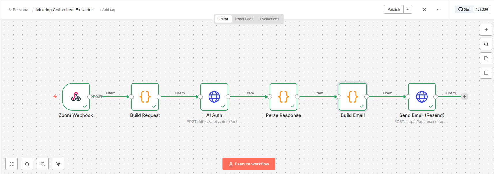
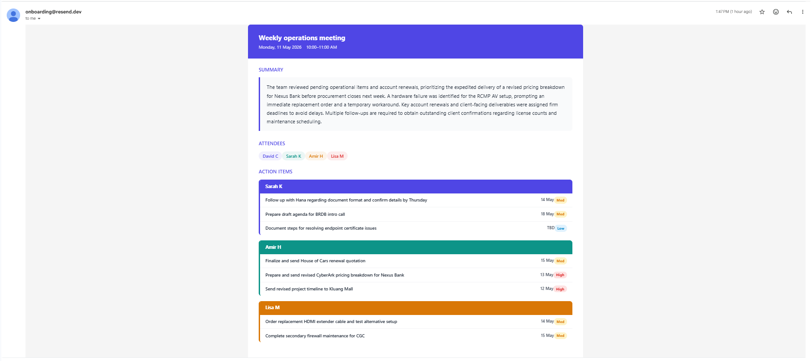

# Meeting Action Item Extractor

Automatically turns Zoom meeting transcripts into structured action item emails — who does what, by when, and how urgent.

## Problem

After a Zoom meeting, action items are buried in notes. Someone has to manually read through, identify tasks, figure out who owns what, and send a follow-up. This automates all of that.

## Approach

I built two implementations to show different ways to solve the same problem:

### 1. Python API (FastAPI)

A full code solution with clean separation of concerns:

```
Transcript → Claude API (extract) → Formatter (HTML) → Resend (email)
                                  → NetworkX (graph store)
```

Each module does one thing:
- `extractor.py` — Claude API call, structured extraction prompt
- `formatter.py` — JSON to HTML email (Jinja2 template)
- `notifier.py` — email via Resend API
- `graph_store.py` — NetworkX knowledge graph for cross-meeting queries
- `app.py` — FastAPI endpoints tying it all together

### 2. n8n Workflow (Low-Code)

Same pipeline as a visual workflow — webhook trigger, HTTP calls to Claude and Resend, with JavaScript for the logic-heavy parts (prompt construction, response parsing, HTML generation).

**Why both?** The Python approach shows architecture and code quality. The n8n approach shows I can work with low-code tools and pick the right approach for the context — n8n is faster to deploy for simple pipelines, Python gives more control for complex logic.

### Tradeoffs

| | Python | n8n |
|---|---|---|
| Setup | `pip install`, run server | Import JSON, configure credentials |
| Extensibility | Add endpoints, graph queries, tests | Add nodes visually |
| Email formatting | Jinja2 template (clean) | Inline HTML in JS (works but harder to maintain) |
| Best for | Production, complex logic | Quick deployment, non-technical teams |

## Key Decisions

- **Claude API** for extraction — one call returns both action items and knowledge graph triples, no extra cost
- **Priority by deadline proximity** — High (within 3 days), Med (1-2 weeks), Low (later/TBD). Urgency cues like "ASAP" bump it up one level
- **Owner-grouped email** — action items grouped by person with unique colors per owner, so each team member sees their tasks at a glance
- **Resend over SMTP** — API key only, no SMTP credentials to manage
- **NetworkX over Neo4j** — lighter dependency, easy to swap later. Enables cross-meeting queries like "all tasks for Sarah" or "who's overloaded"

## Output

The email includes:
- Meeting title, date, and time
- Summary (decisions + blockers)
- Attendees
- Action items grouped by owner (color-coded), with due dates and priority badges
- Next meeting date






## What I'd Improve Next

- **Zoom OAuth integration** — Currently manual transcript input. Would add Zoom Server-to-Server OAuth to auto-fetch recordings and AI Companion summaries after each meeting.
- **Database over files** — Replace the JSON-file-based graph store with SQLite or Postgres for reliability at scale.
- **Deduplication** — If the same meeting is processed twice (e.g., webhook fires twice), detect and skip duplicates.
- **Status tracking** — Add a `/graph/complete` endpoint to mark action items as done, so the graph reflects actual progress over time.
- **Tests** — Add unit tests for the extractor, formatter, and graph store.

## Running

### Python API

```bash
# Install dependencies
python -m venv .venv
source .venv/bin/activate
pip install -r requirements.txt

# Configure environment
cp .env.example .env
# Edit .env with your ANTHROPIC_API_KEY, RESEND_API_KEY, EMAIL_FROM, EMAIL_TO

# Start server
uvicorn app:app --reload
```

Test:
```bash
# From transcript text
curl -X POST http://localhost:8000/extract \
  -H "Content-Type: application/json" \
  -d '{"transcript": "meeting notes here"}'

# From file
curl -X POST http://localhost:8000/upload -F "file=@transcript.txt"
```

API docs at `http://localhost:8000/docs`.

### n8n Workflow

1. Import `n8n/Meeting Action Item Extractor.json` into n8n
2. Set up two Header Auth credentials:
   - **Claude API**: header `x-api-key`, value = your Anthropic API key
   - **Resend API**: header `Authorization`, value = `Bearer re_xxx`
3. Activate the workflow
4. Test:
```bash
jq -Rs '{"text": .}' transcript.txt | curl -X POST \
  "http://localhost:5678/webhook-test/zoom-notes" \
  -H "Content-Type: application/json" -d @-
```

## API Endpoints

| Method | Path | Description |
|--------|------|-------------|
| POST | `/extract` | Extract from transcript text (auto-sends email) |
| POST | `/upload` | Extract from uploaded .txt file |
| POST | `/webhook` | Zoom webhook compatible |
| POST | `/notify` | Re-send email for last extraction |
| GET | `/graph/person/{name}/tasks` | All tasks for a person |
| GET | `/graph/project/{name}/status` | All items for a project |
| GET | `/graph/pending` | All open/pending items |
| GET | `/graph/overloaded` | People with 3+ pending tasks |
